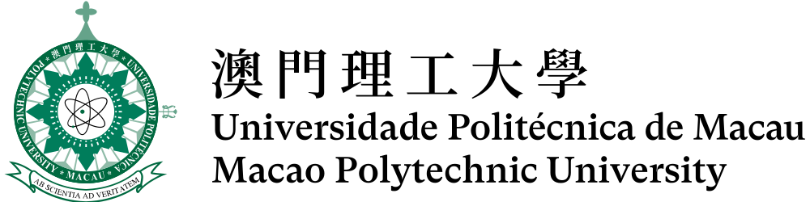

<div align="center">


&nbsp;&nbsp;&nbsp;&nbsp;&nbsp;&nbsp;

&nbsp;&nbsp;&nbsp;&nbsp;&nbsp;&nbsp;


<br/><br/>


<h1>🫀 PDU: Proactive Domain Unification</h1>
<h3>for Robust Echocardiography Segmentation</h3>

<a href="https://conferences.miccai.org/2026/"></a>
<a href="https://github.com/PXinTao/PDU"></a>
<a href="https://github.com/PXinTao/PDU"></a>

<br/><br/>
</div>


🎉 **Accepted as Early Accept at MICCAI 2026** 🎉


---


---

## 💡 Motivation

Deep learning segmentation models trained on one center often fail when deployed at another — due to vendor-specific speckle, gain, and contrast differences. Existing domain generalization methods ask the model to **passively tolerate** these shifts. We take a different approach:

> **PDU proactively unifies the input domain before segmentation** — mapping heterogeneous target images into a fixed source-aligned appearance space, with no target labels and no test-time model updating.

---

## ✨ Highlights

- 🔁 **Inference-time preprocessing** — no target labels, no segmenter fine-tuning
- 🏗️ **Structure-conditioned generation** — HED-guided ControlNet diffusion preserves LV boundaries
- 🔒 **Reliability-guided frequency fusion** — locks low-frequency anatomy, injects high-frequency style under reliability control
- 🔌 **Plug-and-play** — model-agnostic, tested on 6 diverse architectures (CNN / Transformer / Mamba / KAN)
- 📈 **+6.0% Dice, −4.7mm HD95** on EchoNet→CAMUS; recovers **67.2–83.5%** of the cross-domain gap

---

## 🗂️ Repository Structure

```text
PDU/
├── DomainUnifiedSegmentation/
│   ├── train_edge.py                     # HED-like LV edge detector
│   ├── export_edges.py                   # Export boundary cues
│   ├── prepare_controlnet_json.py        # Prepare ControlNet training data
│   ├── train_controlnet_unifier.py       # Stage I: domain unifier training
│   ├── infer_unify_only.py               # Stage II: single-folder unification
│   └── infer_unifier_all_splits_v2.py    # Stage II: batch unification
├── Stage3/
│   ├── train_byol_hypersphere.py         # Stage III: reliability encoder
│   └── compute_S_and_fuse_calib.py       # Stage IV: reliability-guided fusion
├── third_party/controlnet/               # ControlNet (see Acknowledgements)
├── Image/
├── checkpoints/
├── configs/
├── data/
└── README.md
```

---

## 🛠️ Installation

```bash
conda create -n pdu python=3.9 -y && conda activate pdu

# PyTorch (adjust for your CUDA version)
pip install torch torchvision torchaudio

# Core dependencies
pip install numpy opencv-python pillow tqdm scikit-image scikit-learn matplotlib
pip install einops pytorch-lightning

# ControlNet dependencies
cd third_party/controlnet && pip install -r requirements.txt
```

---

## 📁 Data Layout

```text
data/
├── source/
│   ├── images/          # Source domain images (EchoNet)
│   └── masks/           # Source domain labels
├── target/
│   └── images/          # Target domain images (CAMUS / PrivateEcho)
├── edges/source_pred/   # Predicted LV boundary cues
├── unified/
│   ├── source/          # PDU-unified source images (for segmenter training)
│   └── target/          # PDU-unified target images
└── fused/target/        # Final fused inputs for segmentation
```

---

## 🚀 Running PDU

### Stage I — Domain Unifier Training

<details>
<summary>Click to expand</summary>

**Train edge detector:**
```bash
python DomainUnifiedSegmentation/train_edge.py \
  --images_dir data/source/images \
  --masks_dir  data/source/masks \
  --out_ckpt   checkpoints/hed_lv_prob.pth \
  --epochs 30 --batch_size 8 --lr 1e-4 --resize 256 --device cuda
```

**Export boundary cues:**
```bash
python DomainUnifiedSegmentation/export_edges.py \
  --images_dir data/source/images \
  --out_dir    data/edges/source_pred \
  --ckpt       checkpoints/hed_lv_prob.pth \
  --resize 512 --device cuda
```

**Prepare training JSON:**
```bash
python DomainUnifiedSegmentation/prepare_controlnet_json.py \
  --images_dir data/source/images \
  --hints_dir  data/edges/source_pred \
  --out_json   configs/train_controlnet_source.json \
  --prompt "Ultrasound"
```

**Train unifier:**
```bash
python DomainUnifiedSegmentation/train_controlnet_unifier.py \
  --stage1_root third_party/controlnet \
  --train_json  configs/train_controlnet_source.json \
  --sd_ckpt     /path/to/stable-diffusion-v1-5.ckpt \
  --controlnet_ckpt /path/to/control_sd15_canny.pth \
  --out_dir     checkpoints/controlnet_unifier \
  --max_epochs 50 --batch_size 4 --gpus 1
```
</details>

### Stage II — Domain Unification

```bash
# Unify target images
python DomainUnifiedSegmentation/infer_unify_only.py \
  --stage1_root third_party/controlnet \
  --finetuned_ckpt checkpoints/controlnet_unifier/last.ckpt \
  --input_dir  data/target/images \
  --output_dir data/unified/target \
  --prompt "Ultrasound" --device cuda

# Unify source images (for segmenter retraining)
python DomainUnifiedSegmentation/infer_unify_only.py \
  --stage1_root third_party/controlnet \
  --finetuned_ckpt checkpoints/controlnet_unifier/last.ckpt \
  --input_dir  data/source/images \
  --output_dir data/unified/source \
  --prompt "Ultrasound" --device cuda
```

### Stage III — Reliability Representation Learning

```bash
python Stage3/train_byol_hypersphere.py \
  --target_dir  data/source/images \
  --unified_dir data/unified/source \
  --out_ckpt    checkpoints/byol_hypersphere.ckpt \
  --image_size 512 --batch_size 32 --max_epochs 200 --device cuda
```

> **Note:** `--target_dir` should point to **raw source images** and `--unified_dir` to **PDU-unified source images**. The encoder is trained on source raw–unified pairs.

### Stage IV — Reliability-Guided Frequency Fusion

```bash
python Stage3/compute_S_and_fuse_calib.py \
  --target_dir  data/target/images \
  --unified_dir data/unified/target \
  --repr_ckpt   checkpoints/byol_hypersphere.ckpt \
  --out_dir     data/fused/target \
  --device cuda
```

The fused images in `data/fused/target/` are the final inputs to the segmentation model.

---

## 📊 Segmentation Protocol

| | Train input | Test input |
|---|---|---|
| **Baseline** | `data/source/images/` | `data/target/images/` |
| **PDU** | `data/unified/source/` | `data/fused/target/` |

Both use the same segmentation architecture and source labels — the only difference is the input domain.

---

## 📝 Citation

If you find PDU useful in your research, please cite:

```bibtex
@inproceedings{pang2026pdu,
  title     = {Proactive Domain Unification for Robust Echocardiography Segmentation},
  author    = {Pang, Xintao and Yang, Jinlin and Sun, Yue and
               Gao, Zhifan and Li, Wei and Tan, Tao},
  booktitle = {Medical Image Computing and Computer-Assisted Intervention},
  year      = {2026},
  publisher = {Springer}
}
```

---

## 🙏 Acknowledgements

This project builds upon the following excellent works, and we sincerely thank their authors for making their code publicly available:

- [ControlNet](https://github.com/lllyasviel/ControlNet) — structure-conditioned diffusion backbone used in Stage I
- [BYOL-PyTorch](https://github.com/lucidrains/byol-pytorch) — self-supervised hypersphere representation learning used in Stage III
- [EchoNet-Dynamic](https://echonet.github.io/dynamic/) — source domain dataset
- [CAMUS](https://www.creatis.insa-lyon.fr/Challenge/camus/) — target domain dataset

We especially thank the authors of **ADAptation**:

> *ADAptation: Reconstruction-based Unsupervised Active Learning for Breast Ultrasound Diagnosis*  
> MICCAI 2025 | [[Paper]](https://link.springer.com/chapter/10.1007/978-3-031-72378-0_35) · [[Code]](https://github.com/miccai25-966/ADAptation)🎉

---

## 📄 License

This repository is released under the [MIT License](LICENSE).  
Third-party code under `third_party/` follows the respective original licenses.
